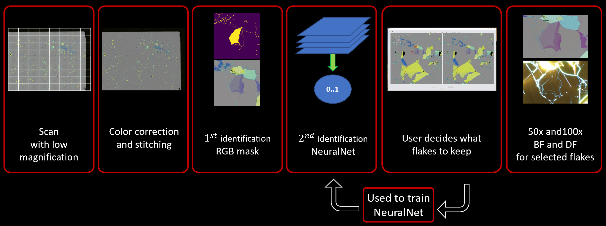
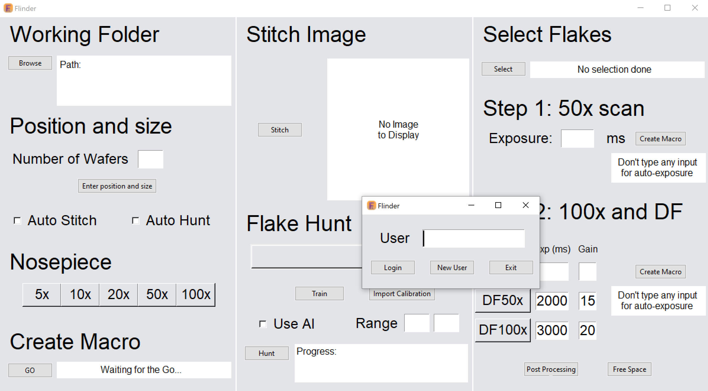

# Flinder

Flinder is a wafer imaging system with a graphical interface that allows you to automatically hunt for van der Waals material flakes.
You will need to have a microscope with a X,Y,Z motorized stage controlled by Nikon NIS element software.

I am working on a second version based on pymmCore and micromanager that will circonvent that limitation.

## Table of Contents

- [Introduction](#introduction)
- [Features](#features)
- [Getting Started](#getting-started)
  - [How Does Flinder Works?](#how-does-flinder-work)
  - [Prerequisites](#prerequisites)
  - [Installation](#installation)
- [Step by Step Guide](#step-by-step-guide)
  - [Create a User Profile](#create-a-user-profile)
  - [Information about the scan](#information-about-the-scan)
  - [Stitching and Hunting](#stitching-and-hunting)
  - [Select the Best Flakes](#select-the-best-flakes)
  - [Close-Up Snaps](#close-up-snaps)
  - [Create Summary pdf](#create-summary-pdf)
  - [Calibration](#calibration)
  - [Train your AI](#train-your-AI)


## Introduction

A significant portion of a student's life in the van der Waals community is dedicated to hunting various 2D materials, such as graphene or hBN, among others. This task is often tedious and, in the case of monolayer hBN, can be nearly impossible.

The goal of Flinder is to largely automate the process and provide users with sufficient information to choose the right flakes for their projects, as well as to easily locate those flakes when it's time to start creating a new heterostructure.

## Features

- Automated scanning of silicon wafers of almost any size
- Flake detection and identification 
- Flake size characterization
- Slowly build your own database of good and bad flakes for each user and each material to speed up hunting with AI
- Full set of images at low and high magnification, bright and dark field
- pdf recap file to help browse through the flakes

## Getting Started

### How Does Flinder Work?

A brief summary of the process:

  - Each chip is scanned at low magnification.
  - Using statistics from the hundreds of pictures taken during the scan, each picture will be color-corrected, and they will then be stitched together to form a wide-field view of the wafer.
  - Because the color profile is now normalized, we can start identifying flakes by their RGB values.
  - Since other dirt or glue marks can have the same RGB values as the flakes you want to identify, each potential flake candidate is passed to a Convolutional Neural Network that will decide whether the flake should be kept or not. This will also help distinguish between usable clean flakes and dirty ones.
  - The user then has the final say and chooses whether to keep the flake or not.
  - This choice is stored in a database and can be used to train the neural network.
  Each user has their own database and neural network as needs vary depending on research projects.
  - A close-up snapshot is taken of the selected flakes in bright field and dark field.
  - A PDF report is generated with all relevant information for each selected flake. For each flake, the user will have access to dimensions, position on the chip, the number of layers, and close-up snapshots in bright and dark fields.

<p align = "center">

</p>

### Prerequisites

The code has been tested with the following packages:
- Nikon NIS element 
- Python 3.8
- TensorFlow 2.9
- Tkinter 0.1
- NumPy 1.18
- MatPlotLib 3.4
- OpenCV 4.0
- Pillow 10.0
- fpdf 1.7

### Installation

Tensorflow is always a bit tricky to install. I usually go with conda:

```
conda create -n flinder_env tensorflow-gpu==2.9.0 python==3.8.10 cudatoolkit=11.2
conda activate flinder_env
conda install -c anaconda numpy==1.18.5
conda install -c conda-forge matplotlib==3.4.2
pip install tkinter
conda install -c conda-forge pillow==8.2.0
conda install -c conda-forge opencv==4.0.1
conda install -c anaconda spyder = 4.2.5
conda install -c conda-forge fpdf==1.7.2
```

If you don't have GPU you may start with this instead:

```
conda create -n flinder_env tensorflow==2.9.0 python==3.8.10  
```


## Step by Step Guide

### Create a User Profile

<p align = "center">

</p>

### Information about the scan

### Stitching and Hunting

### Select the Best Flakes

### Close-Up Snaps

### Create Summary pdf

### Calibration

### Train your AI